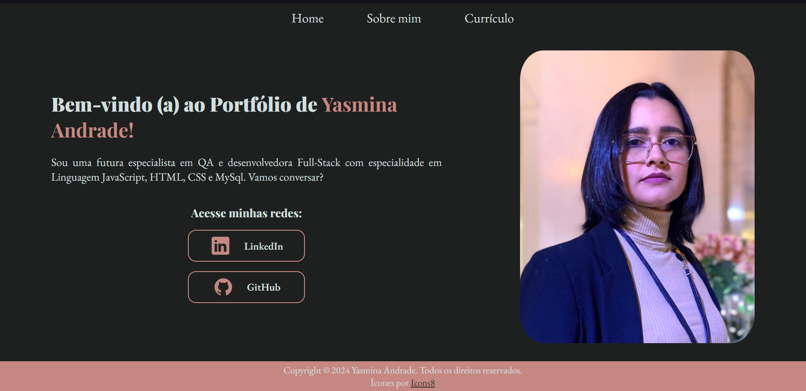

# Portfólio

Página Web do Portfólio de Yasmina Andrade, realizado como desafio da escola Alura.

## Sobre o projeto

- A página contém informações relevantes nas abas Home, Sobre mim e Currículo.
- Possui responsividade nas telas.
- Essa é a versão mais atualizada do projeto

## Técnicas e tecnologias utilizadas

- `HTML`
- `CSS`
- `Media Query`
- `Flexbox`

## Acesso ao site

Você pode [acessar o site](https://portfolio.vercel.app/index.html) para conhecê-lo melhor.

## Mais informações do curso

Você pode [acessar o curso](https://www.linkedin.com/school/aluracursos/) e obter conhecimento necessário para fazer um projeto parecido e com sua cara.
